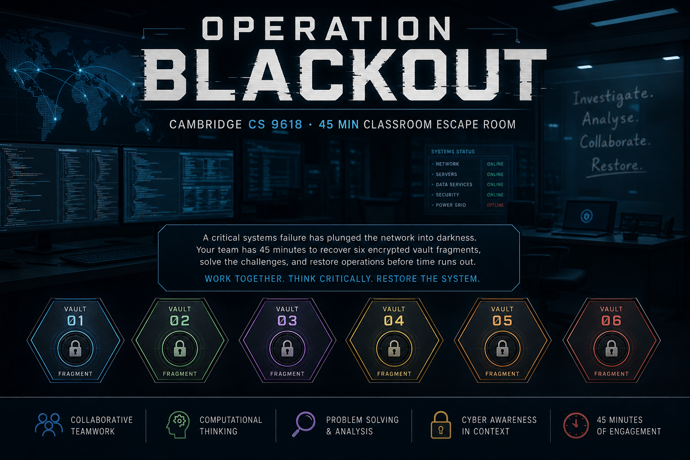
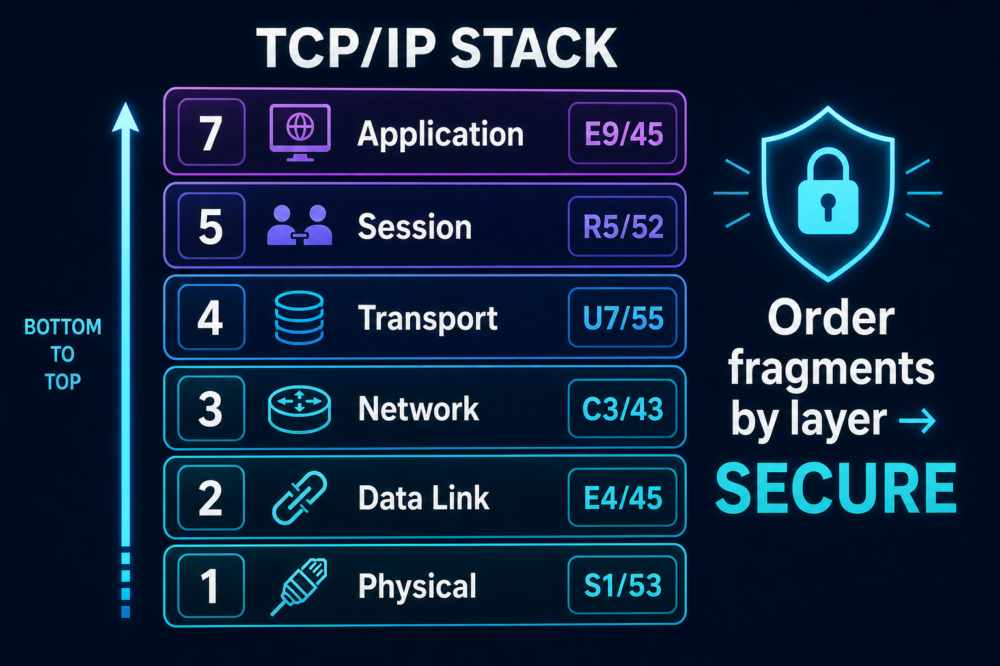
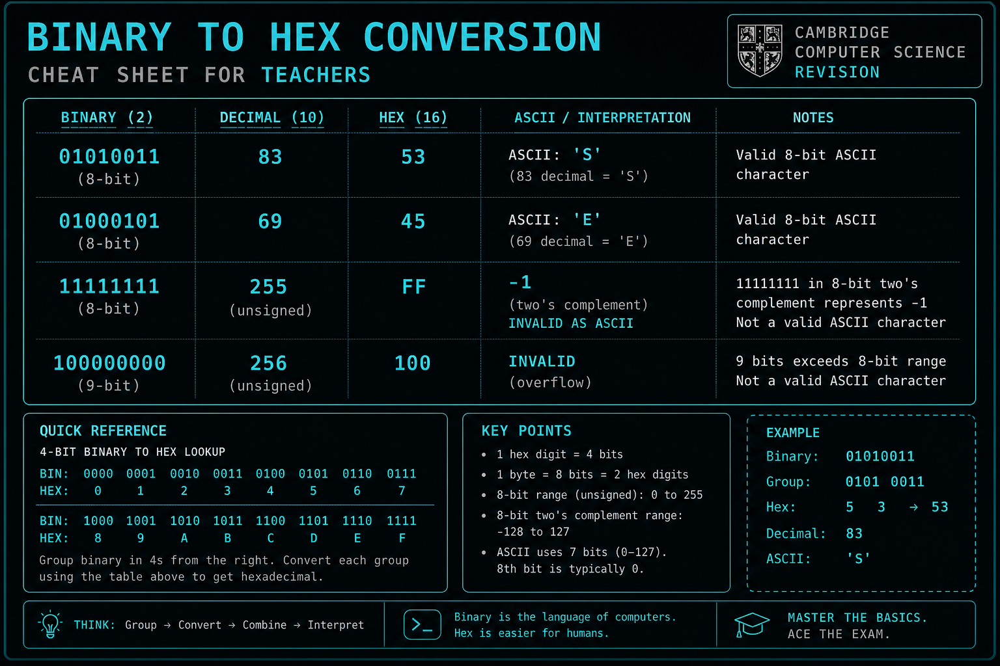
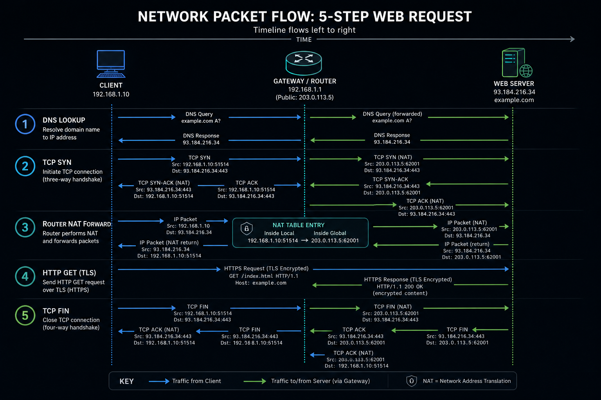
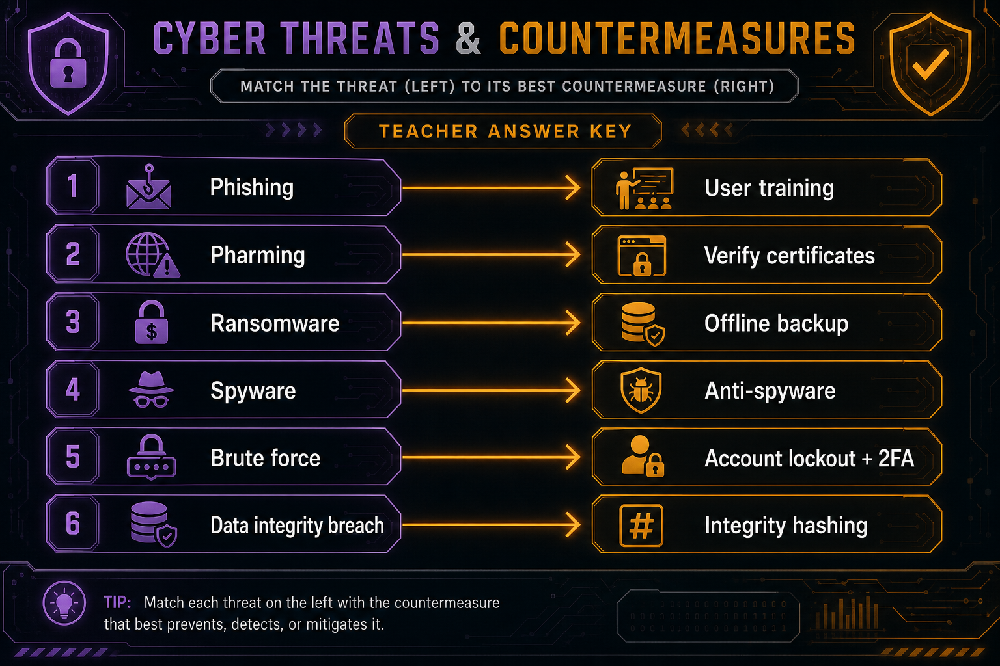
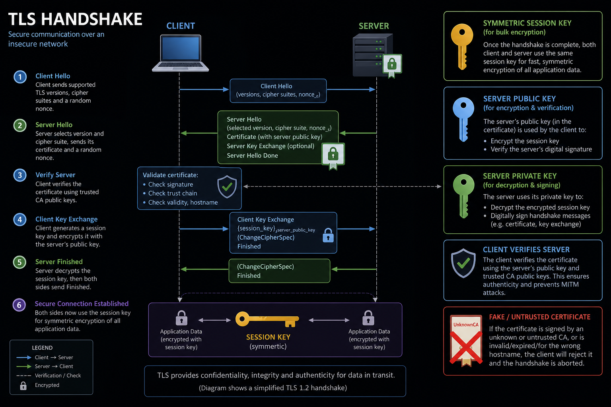
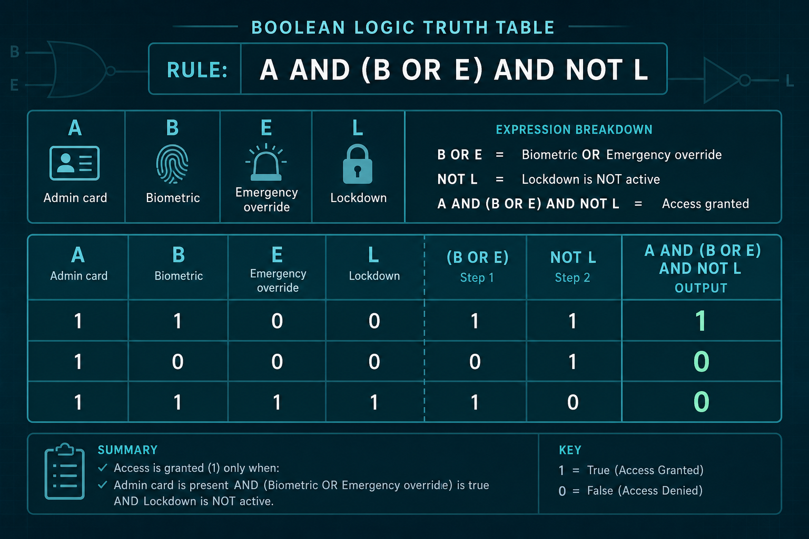
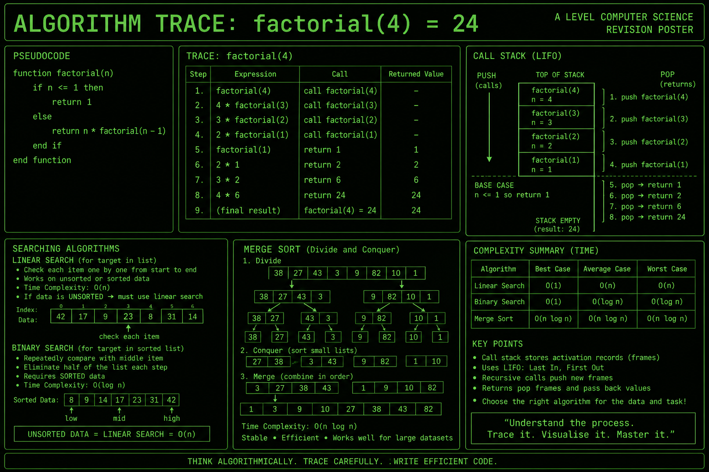
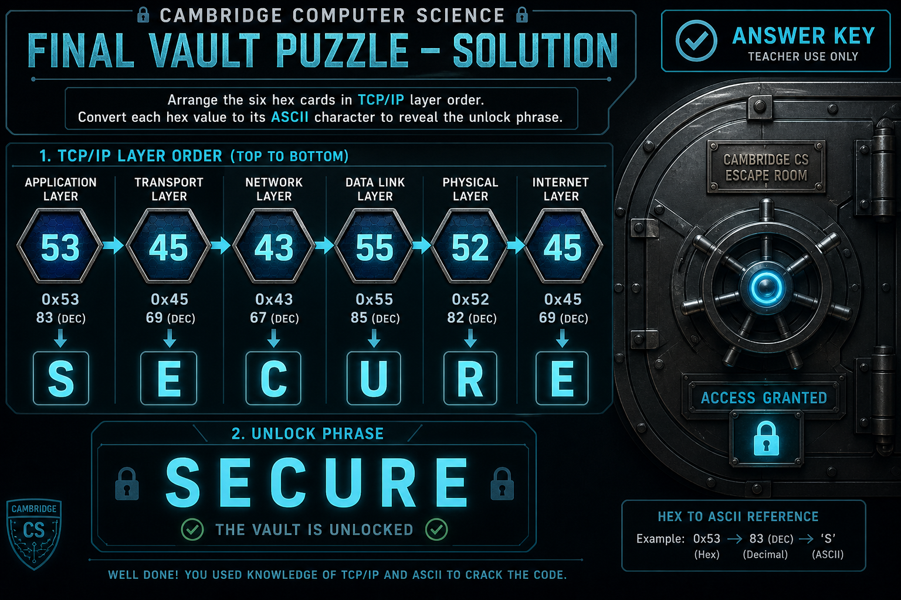
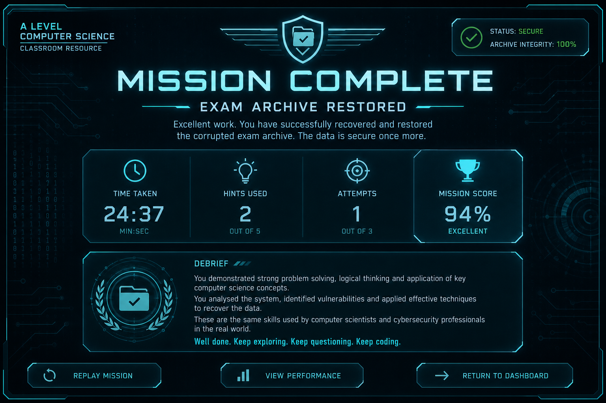

# Operation Blackout — Teacher's Solution Guide

**Cambridge International AS & A Level Computer Science (9618)**  
**Confidential:** For teacher use only. Do not distribute to students before the activity.

---

## Before you start

| Item | Detail |
|------|--------|
| **Duration** | 40–50 minutes (intro 2–3 min + 6 rooms + vault) |
| **URL** | `http://localhost:5173` (or your deployed URL) |
| **Teacher mode** | `/teacher` — answers, hints, syllabus mapping |
| **Reset progress** | Teacher mode → Reset student progress |



**Class setup:** Pair students or solo on laptops/Chromebooks. Remind them hints cost points but never block progress. Defensive cyber only — no real hacking.

---

## Fragment overview (collect all six)

Each room awards one **two-digit hex fragment**. The final vault requires ordering by **TCP/IP stack layer** (lowest first), then converting hex → ASCII.

| Layer | Room | Fragment | ASCII | Label |
|-------|------|----------|-------|-------|
| 1 Physical | Room 5 | **53** | S | S1 |
| 2 Data Link | Room 1 | **45** | E | E4 |
| 3 Network | Room 2 | **43** | C | C3 |
| 4 Transport | Room 4 | **55** | U | U7 |
| 5 Session | Room 3 | **52** | R | R5 |
| 7 Application | Room 6 | **45** | E | E9 |

**Final phrase:** `534543555245` → **SECURE**



---

## Step 1 — Intro (2–3 min)

Students enter an optional callsign and click **Accept mission**.

**Your role:** Read the briefing aloud or let students read silently. Clarify that all scenarios are simulated.

---

## Step 2 — Room 1: The Corrupted Login Banner (~7 min)

**Syllabus:** Binary, hex, ASCII, two's complement (9618 §3.1, §3.2)



### Artifact

| Block | Value | Notes |
|-------|-------|-------|
| BLOCK_A | `01010011` | Valid 8-bit byte |
| BLOCK_B | `11111111` | Two's complement **−1** (not ASCII) |
| BLOCK_C | `100000000` | **Invalid** — 9 bits (overflow) |
| BLOCK_D | `01000101` | Valid 8-bit byte (= E) |
| CHECKSUM | `85` | Denary checksum → hex 55 (U) — **distractor** |

### Solution

| Field | Answer | Working |
|-------|--------|---------|
| BLOCK_A unsigned denary | **83** | 64+16+2+1 |
| Denary 69 as hex | **45** | 69 ÷ 16 = 4 r 5 |
| BLOCK_B two's complement | **-1** | 8-bit: 11111111 = −1 |
| Invalid block ID | **C** | 9-bit overflow |
| Key fragment | **45** | Hex for ASCII **E** |

**Common errors:** Treating 11111111 as 255; trying to decode 9-bit value.

**Plenary:** Why must ASCII use fixed 8-bit bytes?

---

## Step 3 — Room 2: The Network Trace (~7 min)

**Syllabus:** DNS, TCP/IP, routing, public/private IP (§4.1)



### Solution — event order (earliest first)

1. **DNS lookup** — resolve `archive.bsak.edu` → 203.0.113.44  
2. **TCP SYN** — client initiates connection to :443  
3. **Router forward** — NAT 192.168.12.8 → public address  
4. **HTTP GET /vault** — TLS payload exchange  
5. **TCP FIN** — connection closed  

### Security implication

Select: **Private IP visible in trace — reconnaissance risk**

The trace exposes `192.168.12.8` — internal topology leak.

**Key fragment:** **43** (ASCII **C**)

**Common errors:** HTTP before TCP; DNS after connection.

---

## Step 4 — Room 3: The Threat Console (~7 min)

**Syllabus:** Security, privacy, integrity, malware, phishing (§6.1)



### Solution — match incidents to countermeasures

| Incident | Countermeasure |
|----------|----------------|
| Credential harvest email (phishing) | Security awareness training + email filtering |
| DNS redirect (pharming) | Verify digital certificates & monitor DNS/hosts |
| Encrypted file shares (ransomware) | Offline backups + anti-malware scan |
| Keylogger (spyware) | Anti-spyware scan + least-privilege accounts |
| Repeated login attempts (brute force) | Account lockout + two-factor authentication |
| Altered audit records | Integrity checks (hashing/audit trails) |

**Key fragment:** **52** (ASCII **R** — from **R**ights / integrity incident)

**Teaching point:** Strong password alone does **not** stop phishing. Hospital scenario = **integrity**, not just privacy.

---

## Step 5 — Room 4: The Certificate Chain (~7 min)

**Syllabus:** Symmetric/asymmetric encryption, TLS, certificates (§17.1)



### Solution — key assignments

| Operation | Key |
|-----------|-----|
| Encrypt exam archive stream | **Symmetric session key** |
| Encrypt session key for server | **Server's public key** |
| Decrypt session key | **Server's private key** |
| Sign handshake message | **Server's private key** |
| Verify server signature | **Server's public key** |

**Reject certificate:** `UnknownCA Self-Signed` (fake)

**Key fragment:** **55** (ASCII **U**)

**Teaching point:** Symmetric = bulk confidentiality; asymmetric = key exchange + signatures.

---

## Step 6 — Room 5: The Logic Lock (~6 min)

**Syllabus:** Logic gates, truth tables, Boolean algebra (§3.2, §15.2)



### Rule

> Open only if admin card valid **AND** (biometric match **OR** emergency override) **AND NOT** lockdown.

**Variables:** A = admin, B = biometric, E = emergency, L = lockdown

### Solution

**Expression:** `A AND (B OR E) AND NOT L`

**Truth table:**

| A | B | E | L | Open? |
|---|---|---|---|-------|
| 1 | 0 | 0 | 0 | **1** |
| 1 | 0 | 0 | 1 | **0** |
| 0 | 1 | 1 | 0 | **0** |

**Key fragment:** **53** (ASCII **S**)

**Common errors:** XOR instead of OR; missing brackets.

---

## Step 7 — Room 6: The Algorithm Vault (~7 min)

**Syllabus:** Searching, ADTs, recursion, Big O (§9.2, §19.1)



### Solution

| Question | Answer | Reason |
|----------|--------|--------|
| Search type (list unsorted) | **linear** | Binary search needs sorted data |
| ADT for recursive calls | **stack** | LIFO call frames |
| factorial(4) | **24** | 4×3×2×1 |
| Merge sort complexity | **O(n log n)** | Standard result |
| Key fragment | **45** | ASCII **E** |

**Optional bonus:** **OOP** (+75 points)

**factorial trace:** 4→3→2→1 push; returns 1,2,6,**24** pop.

---

## Step 8 — Final vault: Exam Archive (~5 min)

**Syllabus:** TCP/IP integration, hex → ASCII (§4.1, §3.1)



### Solution

1. **Order fragments by stack layer** (not room number):

   `room5 → room1 → room2 → room4 → room3 → room6`

2. **Hex sequence:** `53 45 43 55 52 45`

3. **Convert to ASCII:** S E C U R E

4. **Enter unlock phrase:** **SECURE**

**Common errors:** Ordering by room 1–6 (gives wrong letters); typing hex instead of ASCII.

---

## Step 9 — Completion screen

Students see time, score, hints used, and debrief. Local leaderboard stores top scores in the browser.



### Scoring (approximate)

- Base: 1000  
- Time bonus: faster than 45 min  
- Hint penalty: −35 per hint  
- Attempt penalty: −12 per attempt beyond 6  
- Bonus: +75 for Room 6 OOP answer  

---

## Hint sequence (all rooms)

Use in order if students are stuck:

1. **Level 1** — Gentle nudge (concept direction)  
2. **Level 2** — More direct clue  
3. **Level 3** — Nearly gives the method  

Full hint text is in **Teacher mode** (`/teacher`) and in `src/data/puzzles/room*.ts`.

---

## Suggested plenary (10 min)

1. Which countermeasure would **not** alone have stopped this fictional breach?  
2. How does each room map to a TCP/IP layer?  
3. Privacy vs integrity — give a real-world example of each.  
4. Why does TLS use both symmetric and asymmetric encryption?  
5. When is binary search valid — and when must you use linear search?

---

## Quick answer card

```
Room 1: 83, 45, -1, C, fragment 45
Room 2: dns→syn→route→http→fin, private_ip, fragment 43
Room 3: see matching table, fragment 52
Room 4: see key table, reject fake cert, fragment 55
Room 5: A AND (B OR E) AND NOT L, truth table, fragment 53
Room 6: linear, stack, 24, O(n log n), fragment 45
Vault:  layer order → SECURE
```

---

*Operation Blackout · Cambridge CS 9618 · Teacher guide v1.0*
